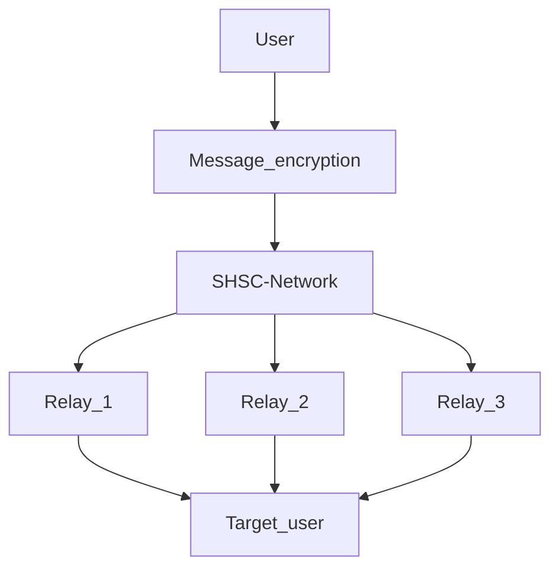

# who am I?

Im the creator of **AROA-DEV** Organization, im also a junior developer, who is interested in cybersecurity and privacy, thats what **AROA-DEV** was created for to develope a full tutorial for non technical people to follow 

Personal Projects: 

Name:  **Secure Self Hosted Communications** (SHSC)
Status: in progress
Description: A self hosted network for communications using relay/nodes, that you will have to deploy and setup yourself over your operating area just like TAK program. Im planing on releasing a an version that will use internet for wide area comunications
<!-- :computer: :infinity: :satellite: :closed_lock_with_key: :globe_with_meridians: -->

Progress:
- [x] Crating the OS
- [] Checking the OS for possible vulnerabilities ( Need more time to check )
- [x] Creating a safe communications network
- [x] Creating secure keys with Time-based One-time key Algorithm (developed by me)
- [x] Deployment for testing 1
- [x] Deployment of secure nods 

 
 

# My contributions to the community

Im the main developer in AROA-DEV. Im working on the tutorials for the AROA-DEV page, some of the tutorials are a little simple and missing some details but thats the problem with been a small team of developers.
